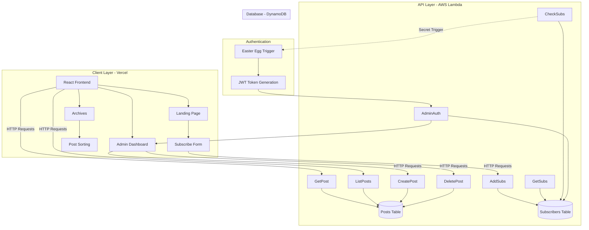

**📚 Niche, Holy Tech**


> A serverless blog platform celebrating the overlooked tech we use daily. Built to explore AWS Lambda architecture while creating a space for reflective technical writing that questions the mundane.

[Live Demo](https://niche-holy-tech.vercel.app/)

---

## 🎯 Overview

Niche, Holy Tech is a full-stack serverless blog platform that combines modern React frontend with AWS Lambda backend infrastructure. Unlike typical tech blogs focused on headlines and hype, this platform explores the everyday technologies we take for granted—the "niche" and "holy" aspects of development that deserve appreciation but often get overlooked in casual conversation.

### ✨ Why This Project?
- **Serverless-First Architecture**: Complete AWS Lambda implementation eliminating traditional server management
- **Custom-Built Experience**: Full control over features and design, built from scratch for learning and ownership
- **Thoughtful Content Platform**: Creating space for technical reflection without the pressure of trending topics
- **Easter Egg Authentication**: Creative admin access mechanism demonstrating unconventional problem-solving

---

## 🚀 Features

### Core Functionality
- ✅ **Subscription System**
  - Email-based newsletter subscriptions
  - Subscriber verification before content access
  - LocalStorage session management for returning visitors
  - Admin dashboard for subscriber list management

- ✅ **Content Management**
  - Markdown-based post creation with live preview
  - Draft and publish workflow
  - Edit previous posts with instant updates
  - Post viewing in new tab from admin dashboard
  - Archive access restricted to subscribers only

- ✅ **User Experience**
  - Latest post preview on landing page for all visitors
  - Comprehensive archives with sorting options:
    - Latest posts (newest first)
    - Oldest posts (chronological)
    - Longest reads (by content length)
    - Shortest reads (quick consumption)
  - Responsive design across devices
  - Theme toggle (dark/light mode with persistence)

- ✅ **Admin Features**
  - Hidden admin access via Easter egg in subscription check
  - Full CRUD dashboard for post management
  - Markdown editor for writing and editing
  - Subscriber analytics and list viewing

### Security Features
- 🔒 JWT-based authentication for admin routes
- 🔐 Email validation for subscriptions
- 🛡️ Protected API endpoints via Lambda authorizers
- 🔑 Creative Easter egg authentication mechanism

---

## 🛠️ Tech Stack

### Frontend
| Technology | Purpose |
|------------|---------|
| **React 18** | Modern UI library with hooks for state management |
| **TypeScript** | Type-safe development for better code quality |
| **Vite** | Lightning-fast build tool and dev server |
| **Styled Components** | CSS-in-JS for component-scoped styling |
| **React Router** | Client-side routing for SPA navigation |
| **LocalStorage API** | Session persistence for subscriber authentication |

### Backend (AWS Serverless)
| Technology | Purpose |
|------------|---------|
| **AWS Lambda** | Serverless compute for all API endpoints |
| **DynamoDB** | NoSQL database with two tables (Posts, Subscribers) |
| **CloudWatch** | Logging and monitoring Lambda functions |
| **API Gateway** | REST API management (default AWS configuration) |
| **JWT** | Secure token-based admin authentication |

### Deployment
- **Frontend**: Vercel (with automatic GitHub deployments)
- **Backend**: AWS Lambda (serverless functions)
- **Database**: AWS DynamoDB (fully managed NoSQL)

---

## 🏗️ Architecture



### Data Flow

1. **Subscription & Access Flow**
   - User subscribes → Email sent to `AddSubs` Lambda → Stored in Subscribers table
   - Email saved to LocalStorage → Auto-check on return visits
   - `CheckSubs` Lambda verifies email → Archives unlocked
   - Easter egg trigger in `CheckSubs` → Redirects to admin login

2. **Content Consumption Flow**
   - Landing page → `ListPosts` Lambda → Fetches latest post preview
   - User subscribes → Archives accessible
   - Archives page → `ListPosts` with sorting parameters → Displays all posts
   - Post selection → `GetPost` Lambda → Full post content rendered

3. **Admin Content Management Flow**
   - Easter egg triggered → Admin login page displayed
   - Admin authenticates → JWT token issued → Stored in LocalStorage
   - Dashboard loads → `ListPosts` with admin flag → All posts with edit options
   - Create post → Markdown input → Save as draft or publish → `CreatePost` Lambda
   - Edit post → Markdown editor populated → `CreatePost` Lambda (update mode)
   - Delete post → Confirmation → `DeletePost` Lambda → Removed from Posts table

4. **Cold Start Mitigation**
   - Free tier Lambda experiences cold starts (~2-3 second delays)
   - Accepted trade-off for serverless benefits
   - Future optimization: Scheduled warming or provisioned concurrency

---

## 📁 Project Structure

### Frontend Structure
```
niche-holy-tech/
├── public/
│   └── vite.svg
├── src/
│   ├── assets/
│   │   ├── Admin.tsx              # Admin dashboard & login with styled-components
│   │   ├── Archive.tsx            # Archives page with post sorting
│   │   └── PostPage.tsx           # Individual post view
│   ├── App.tsx
│   ├── main.tsx
│   └── vite-env.d.ts
├── .env
├── .gitignore
├── eslint.config.js
├── index.html
├── package.json
├── tsconfig.json
├── tsconfig.app.json
├── tsconfig.node.json
├── vercel.json                    # Vercel deployment config
└── vite.config.ts
```

### Database Schema

**Posts Table (DynamoDB)**
```javascript
{
  slug: String,
  title: String,
  content: String (Markdown format),
  excerpt: String,
  status: String ("draft" | "published"),
  tags: String[]
  createdAt: String,
  updatedAt: String,
  publishedAt: String | null
}
```

**Subscribers Table (DynamoDB)**
```javascript
{
  email: String (Primary Key),
  subscribedAt: String,
  id: String
}
```

---

## 📌 API Endpoints

### Public Routes
| Method | Endpoint | Lambda Function | Description | Auth Required |
|--------|----------|----------------|-------------|---------------|
| GET | `/api/posts` | `ListPosts` | Get all published posts | No |
| GET | `/api/posts/:id` | `GetPost` | Get single post by ID | No |
| POST | `/api/subscribe` | `AddSubs` | Add new subscriber | No |
| POST | `/api/check-subscription` | `CheckSubs` | Verify subscriber email + Easter egg | No |

### Admin Routes (Protected)
| Method | Endpoint | Lambda Function | Description | Auth Required |
|--------|----------|----------------|-------------|---------------|
| POST | `/api/admin/login` | `AdminAuth` | Generate JWT token | No (credentials required) |
| POST | `/api/admin/posts` | `CreatePost` | Create new post | Yes (JWT) |
| PUT | `/api/admin/posts/:id` | `CreatePost` | Update existing post | Yes (JWT) |
| DELETE | `/api/admin/posts/:id` | `DeletePost` | Delete post | Yes (JWT) |
| GET | `/api/admin/subscribers` | `GetSubs` | Get all subscribers | Yes (JWT) |

**Authentication:** Protected routes require JWT token in `Authorization: Bearer <token>` header.

### Query Parameters

**ListPosts Filtering:**
- `?sort=latest` - Most recent posts first (default)
- `?sort=oldest` - Chronological order
- `?sort=longest` - By content length (descending)
- `?sort=shortest` - By content length (ascending)
- `?status=all` - Include drafts (admin only)

---

## 🧩 Challenges Overcome

### 1. CORS Configuration with AWS Lambda
**Problem:** Vercel frontend and AWS Lambda backend were experiencing CORS errors. Lambda was automatically adding `Access-Control-Allow-Origin` headers, but our code was also adding them, causing header duplication that browsers rejected.

**Solution:** 
- Identified that AWS API Gateway was auto-injecting CORS headers
- Removed redundant header configuration from Lambda function responses
- Configured API Gateway CORS settings properly to handle preflight requests
- Tested with both development (localhost) and production (Vercel) origins
- Added proper credentials support for cookie/token handling

### 2. Lambda Cold Start Performance
**Problem:** Free tier Lambda functions experience 2-3 second cold starts on first invocation, creating poor UX for initial page loads.

**Solution:**
- Accepted as inherent serverless trade-off for cost savings
- Implemented loading states in frontend to manage user expectations
- Optimized Lambda package sizes to reduce cold start time
- Future consideration: Scheduled CloudWatch Events to keep functions warm, or provisioned concurrency for critical endpoints

### 3. Easter Egg Admin Authentication
**Problem:** Wanted to minimize development work on full authentication UI while adding creative, non-obvious admin access.

**Solution:**
- Embedded secret trigger in `CheckSubs` Lambda function
- Specific email pattern triggers admin login redirect instead of standard subscription check
- Balances security through obscurity with JWT-based actual authentication
- Demonstrates creative problem-solving and unconventional thinking
- Admin portal properly secured with JWT tokens after Easter egg discovery

### 4. Chrome-Specific Rendering Bug
**Problem:** Website fails to load on Chrome browser on personal devices, but works perfectly on all other browsers (Firefox, Safari, Edge) and Chrome on other devices.

**Solution:**
- Issue remains under investigation
- Suspected causes: Chrome extension conflicts, local cache corruption, or browser version-specific bug
- Temporary workaround: Using alternative browsers for testing and access
- Future debugging: Clear Chrome data, test in Incognito mode, check DevTools console errors

### 5. LocalStorage Session Management
**Problem:** Needed persistent sessions without backend session storage complexity.

**Solution:**
- Implemented LocalStorage for subscriber email and JWT token storage
- Email persists across browser sessions for automatic archive access
- Added checks for LocalStorage availability and graceful fallbacks
- Simple, effective client-side session management without database overhead

---

## 🔮 Potential Improvements

### Short-Term
- [ ] Add loading skeletons for better perceived performance during Lambda cold starts
- [ ] Implement post preview cards with featured images
- [ ] Add estimated read time calculation and display
- [ ] Improve mobile responsiveness for admin dashboard
- [ ] Add confirmation modals for post deletion
- [ ] Implement better error messaging for failed API calls

### Medium-Term
- [ ] Add S3 integration for image uploads in posts
- [ ] Implement full-text search across all posts
- [ ] Add tagging system for post categorization
- [ ] Create RSS feed for subscribers
- [ ] Add post sharing functionality (social media buttons)
- [ ] Implement analytics dashboard (post views, popular content)

### Long-Term
- [ ] Add commenting system with moderation
- [ ] Implement CI/CD pipeline for Lambda deployments
- [ ] Add email notifications for new posts to subscribers
- [ ] Migrate to API Gateway custom domain
- [ ] Implement CDN caching for post content
- [ ] Add provisioned concurrency for Lambda to eliminate cold starts
- [ ] Fix Chrome compatibility issue through systematic debugging

---

## 🎓 What I Learned

This project was a comprehensive deep-dive into serverless architecture and full-stack development:

### Technical Skills
- **AWS Lambda Development**: Understanding serverless compute, function design, and event-driven architecture
- **DynamoDB Management**: NoSQL database design, partition keys, and query optimization
- **CORS Mastery**: Navigating cross-origin complexities between different hosting platforms
- **TypeScript with React**: Building type-safe frontend applications with modern hooks

### Problem-Solving
- **Debugging Distributed Systems**: Troubleshooting issues across frontend (Vercel), backend (AWS), and database layers
- **Trade-off Analysis**: Balancing cold start performance vs. serverless cost benefits
- **Creative Solutions**: Easter egg authentication as unconventional but practical approach
- **Platform Limitations**: Working within free tier constraints while maintaining functionality

### Development Philosophy
- **Custom > Convenience**: Building from scratch provides deeper learning than using platforms like WordPress
- **Ownership Matters**: Full control over features, design, and data
- **Imperfect is OK**: Shipping with known issues (Chrome bug, cold starts) while documenting them honestly
- **Niche Content Value**: Creating space for reflective technical writing that doesn't chase trends

### Personal Growth
- **Confidence in AWS**: Comfortable navigating and deploying multiple AWS services
- **Full-Stack Competence**: Can independently build, deploy, and maintain complete applications
- **Documentation Skills**: Articulating technical decisions and challenges clearly
- **Embracing Serverless**: Understanding when serverless architecture is (and isn't) appropriate

---

## 📧 Contact

**Created by Sedow360**

- GitHub: [@Sedow360](https://github.com/Sedow360)
- Project Repository: [Niche-Holy-Tech](https://github.com/Sedow360/Niche-Holy-Tech)
- Live Site: [niche-holy-tech.vercel.app](https://niche-holy-tech.vercel.app/)

For questions, suggestions, or bug reports, please open an issue in the repository.

---

## 📄 License

This project is open source and available under the [MIT License](LICENSE).

---

*"Celebrating the mundane tech that powers our daily work—because even the ordinary deserves reflection."*